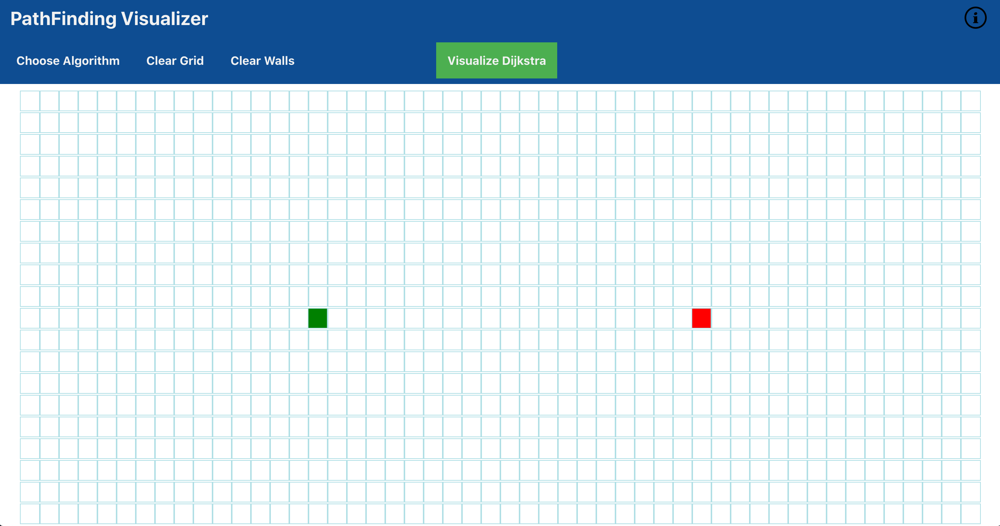

# PathFinding Visualizer 
  
 
 A simple pathfinding visualizer app, built with react to visualize dijkstra and A* pathfinding algorithms.
 
## Overview
 The app has a simple interface where the one can build walls, move around the start and end nodes, choose algorithms from the hover drop down and visualize the selected algorithm with the Visualize algorithm button. The algorithms will avoid the walls and try to reach the end node from the start node in the shortest path possible.
 
 If you want built something similar and want understand the working of different components, I recommend looking at this [medium post](https://medium.com/@prudhvi.gnv/path-finding-visualizer-using-react-from-creating-to-building-and-deploying-bd1e2bc64696). You can also checkout this [youtube video](https://www.youtube.com/watch?v=msttfIHHkak) by Clément Mihailescu to understand how the algorithms and visualization work.

 
This project was bootstrapped with [Create React App](https://github.com/facebook/create-react-app).

#### [Live DEMO](http://shucoll.github.io/pathfinding-visualizer)

## Installation and Usage

 First clone the rep
```sh
git clone https://github.com/shucoll/pathfinding-visualizer.git  
```
Install the dependencies
```sh
npm install
```
Runs the app in the development mode.
Open http://localhost:3000 to view it in the browser.
```sh
npm start
```
Create a production build
```sh
npm run build
```
You can then deploy the app with github pages or any other hosting platform.

## Examples

App interface


Dropdown to select algorithms


Creating walls with click and drag


Visualizing the selected algorithm


Generated shortest path after visualization


